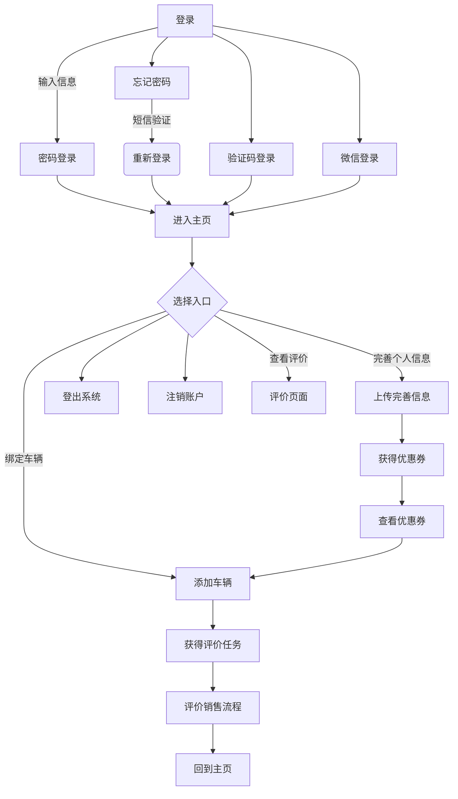

# UReadHub
英文读书-读书笔记开源仓库

```mermaid
graph TD
A[登录] -->|输入信息|Q[密码登录]
Q --> B[进入主页]

A --> Z[忘记密码] 
Z --> |短信验证| Y(重新登录)
Y --> B

A --> P[验证码登录]
P --> B

A --> O[微信登录]
O --> B

B --> C{选择入口}
C -->|绑定车辆| D[添加车辆]
D --> G[获得评价任务]
G --> H[评价销售流程]
H --> I[回到主页]

C -->|完善个人信息| E[上传完善信息]
E --> J[获得优惠券]
J --> K[查看优惠券]
K --> D

C --> M[登出系统]

C --> N[注销账户]

C -->|查看评价| F[评价页面]

```
